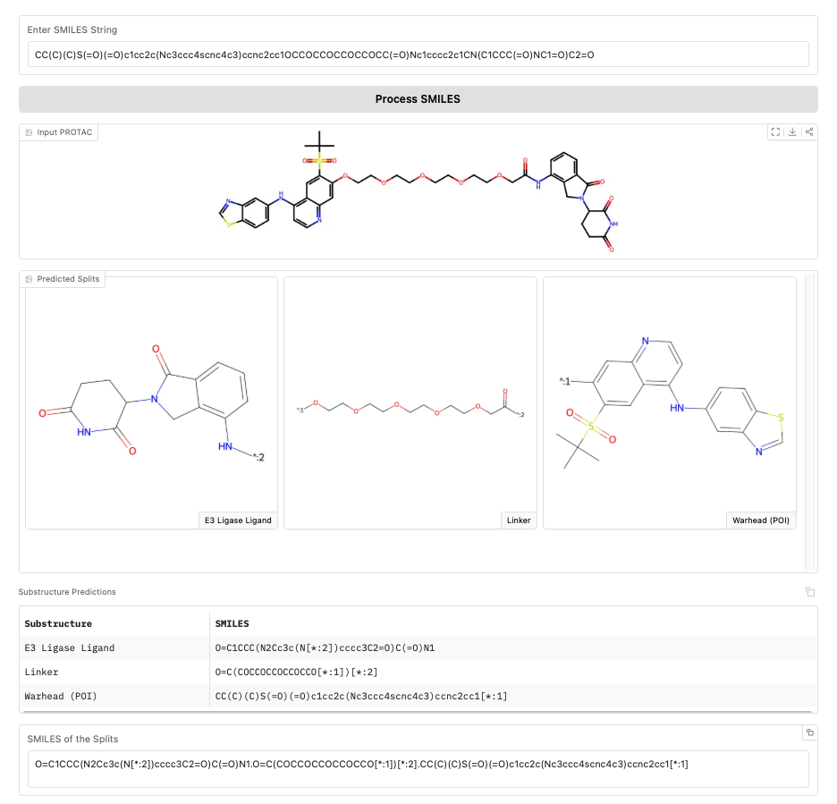

# PROTAC-Splitter: A Machine Learning Framework for Automated Identification of PROTAC Substructures

This repository contains the program code to split PROTAC molecules into their three constituent substructures: the **E3 ligand**, the **linker**, and the **POI warhead**.

A Gradio app is available to split PROTAC molecules and visualize the results: [https://huggingface.co/spaces/ailab-bio/PROTAC-Splitter-App](https://huggingface.co/spaces/ailab-bio/PROTAC-Splitter-App).

<p align="center">
  
</p>

## Table of Contents 📜

- [Installation](#installation)
- [Configuration](#configuration)
- [Usage](#usage)
  - [Python API](#python-api)
  - [Command-line interface](#command-line-interface)
  - [Gradio app](#gradio-app)
- [Splitting strategies](#splitting-strategies)
- [Data availability](#data-availability)
- [Contributing](#contributing)
- [License](#license)
- [Reference](#reference)

## Installation 🛠️

Requires Python 3.10+. Always use a virtual environment.

### pip (recommended)

```bash
# Core package — includes XGBoost and heuristic splitting (no GPU required)
pip install git+https://github.com/ribesstefano/PROTAC-Splitter.git

# With Transformer model support (adds PyTorch; ~2 GB download)
pip install "git+https://github.com/ribesstefano/PROTAC-Splitter.git[transformer]"

# With Gradio app + plotting dependencies
pip install "git+https://github.com/ribesstefano/PROTAC-Splitter.git[scripts]"

# Full development install (all extras + pytest)
pip install "git+https://github.com/ribesstefano/PROTAC-Splitter.git[dev]"
```

### From source with uv

```bash
git clone https://github.com/ribesstefano/PROTAC-Splitter.git
cd PROTAC-Splitter
pip install uv
uv sync --extra dev        # install all extras into .venv
source .venv/bin/activate
```

## Models Cache Configuration ⚙️

Pretrained models are downloaded automatically on first use. To set a custom cache directory, you can use the `PROTAC_SPLITTER_CACHE_DIR` environment variable. To do so, create a `.env` file in your working directory (or copy `.env.example`) to override defaults:

```bash
cp .env.example .env
```

```ini
# .env
# Directory where pretrained models are cached (default: ~/.cache/protac_splitter)
PROTAC_SPLITTER_CACHE_DIR=~/.cache/protac_splitter
```

Environment variables are loaded automatically via `python-dotenv` when the package is imported.

> [!NOTE]
> The XGBoost model (~17 MB) is cached to `PROTAC_SPLITTER_CACHE_DIR` on the first call to `split_protac()`.  
> The Transformer model, if installed, is cached by HuggingFace `transformers` in `HF_HOME` (see [here](https://huggingface.co/docs/datasets/en/cache)).

## Usage 🚀

### Python API 🐍

```python
from protac_splitter import split_protac

# --- Single SMILES string ---
protac = (
    "CC(C)(C)S(=O)(=O)c1cc2c(Nc3ccc4scnc4c3)ccnc2cc1OCCOCCOCCOCCOCC(=O)Nc1cccc2c1CN(C1CCC(=O)NC1=O)C2=O"
    "Cc1nnc2n1-c1sc(C#Cc3cnn(-c4cccc5c4C(=O)N(C4CCC(=O)NC4=O)C5=O)c3)c(Cc3ccccc3)c1COC2"
)
result = split_protac(protac)
print(result)
# {'SMILES': '...', 'default_pred_n0': 'e3_smiles.linker_smiles.poi_smiles', 'model_name': 'Heuristic', 'heuristic_params': '...', 'n_flags': 0, 'review_reasons': ''}

# --- List of SMILES ---
results = split_protac([protac, protac])
for r in results:
    print(r["default_pred_n0"])

# --- pandas DataFrame ---
import pandas as pd
df = pd.read_csv("protacs.csv") # must have a column for SMILES strings
result_df = split_protac(df, protac_smiles_col="PROTAC SMILES")
print(result_df[["PROTAC SMILES", "default_pred_n0", "model_name"]].head())
```

**`split_protac` arguments:**

| Parameter | Type | Default | Description |
|---|---|---|---|
| `protac_smiles` | `str \| list \| DataFrame` | *(required)* | SMILES to split. Single string, list of strings, or DataFrame with a `protac_smiles_col` column. |
| `model` | `str` | `"adaptive"` | Splitting strategy. See [Splitting strategies](#splitting-strategies) for valid values. |
| `fix_predictions` | `bool` | `True` | Apply cheminformatics post-processing to Transformer predictions before reassembly check. |
| `protac_smiles_col` | `str` | `"SMILES"` | Column name for SMILES when input is a DataFrame; also used as key name in output dicts. |
| `batch_size` | `int` | `1` | Inference batch size (Transformer only). |
| `beam_size` | `int` | `5` | Beam-search width (Transformer only). Higher values may improve quality at the cost of speed. |
| `device` | `int \| str \| None` | `None` | Torch device for the Transformer (`"cpu"`, `"cuda"`, `0`, …). Auto-detects GPU when `None`. |
| `num_proc` | `int` | `1` | Parallel worker processes. Effective for heuristic only (XGBoost is always single-process). |
| `verbose` | `int` | `0` | Verbosity level (0 = silent). |
| `betweenness_threshold` | `float` | `0.4` | Betweenness-centrality cut-off for the heuristic. Higher values are more conservative. |
| `use_capacity_weight` | `bool` | `False` | Weight graph edges by bond order when computing betweenness centrality (heuristic only). |
| `betweenness_approx_frac` | `float \| None` | `None` | Fraction of nodes to sample for approximate betweenness centrality. `None` uses exact computation. |
| `adaptive_heuristic_grid` | `list[tuple[float, bool]] \| None` | `None` | `model="adaptive"` only. `(betweenness_threshold, use_capacity_weight)` pairs to try, in order. `None` uses a built-in 6-point grid seeded with the package default first. |
| `adaptive_use_xgboost` | `bool` | `True` | `model="adaptive"` only. Whether the XGBoost stage runs on molecules the heuristic grid left flagged. |
| `adaptive_use_transformer` | `bool` | `False` | `model="adaptive"` only. Whether the Transformer stage runs on molecules still flagged after XGBoost. Off by default (needs the `[transformer]` extra; GPU recommended). |
| `use_transformer` | `bool \| None` | `None` | **Deprecated.** Use `model='transformer'` instead. |
| `use_xgboost` | `bool \| None` | `None` | **Deprecated.** Use `model='xgboost'` instead. |

`model="adaptive"` returns three extra keys beyond the usual `default_pred_n0` / `model_name`: `heuristic_params` (which grid point won, when `model_name == "Heuristic"`, else `None`), `n_flags`, and `review_reasons` — a semicolon-joined list of the [`evaluation.score_split()`](protac_splitter/evaluation.py) plausibility checks that still fired on the winning candidate (empty string if none). Running `model="adaptive"` over a batch of test molecules and looking at which `heuristic_params` wins most often is a good way to pick new defaults for `betweenness_threshold` / `use_capacity_weight`.

```python
result = split_protac(protac, model="adaptive")
print(result["model_name"], result["heuristic_params"], result["n_flags"], result["review_reasons"])
# 'Heuristic' 'betweenness_threshold=0.4,use_capacity_weight=False' 0 ''
```

### Command-line interface 🖥️

After installation the `protac-splitter` command is available:

```bash
# Split a single SMILES with the default adaptive strategy
protac-splitter --smiles "CC(C)(C)S(=O)(=O)c1cc2c..."

# Use the heuristic algorithm (no model download)
protac-splitter --smiles "..." --model heuristic

# Tune the heuristic threshold
protac-splitter --smiles "..." --model heuristic --betweenness-threshold 0.5

# Use bond-capacity weighting in betweenness centrality
protac-splitter --smiles "..." --model heuristic --use-capacity-weight

# Transformer model (requires [transformer] extra)
protac-splitter --smiles "..." --model transformer

# Transformer with XGBoost fallback
protac-splitter --smiles "..." --model "transformer->xgboost"

# XGBoost with heuristic fallback
protac-splitter --smiles "..." --model "xgboost->heuristic"

# QC-gated escalation (default): heuristic grid -> XGBoost -> (optionally)
# Transformer, scored by evaluation.score_split; prints which method/params
# won plus the remaining QC flags (if any) -- equivalent to omitting --model
protac-splitter --smiles "..." --model adaptive
protac-splitter --smiles "..." --model adaptive --adaptive-use-transformer

# Batch processing from CSV
protac-splitter --input-csv protacs.csv --smiles-col "SMILES" \
                --output-csv results.csv --model xgboost

# Machine-readable CSV output
protac-splitter --smiles "..." --model heuristic --output-format csv

# Show all options
protac-splitter --help
```

### Output format

All strategies return predictions in a dot-separated SMILES format:

```
e3_smiles.linker_smiles.poi_smiles
```

Attachment points are encoded as `[*:1]` (POI side) and `[*:2]` (E3 side).

## Splitting strategies 🧠

PROTAC-Splitter supports multiple strategies, selectable via `--model` (CLI) or via the `model` argument (Python API):

| Value | Description |
|---|---|
| `adaptive` *(default)* | QC-gated escalation, not just fallback-on-failure: a small heuristic `(betweenness_threshold, use_capacity_weight)` grid runs first, then XGBoost, then — only with `--adaptive-use-transformer` / `adaptive_use_transformer=True` — the Transformer. Each stage only runs on molecules the previous stage left flagged by [`evaluation.score_split()`](protac_splitter/evaluation.py) (structural validity, fragment size, linker topology, known-ligand similarity), and a later stage only replaces the current best if it scores strictly better. Slower than a single strategy, but reports which method/params won — see [`adaptive_*` arguments](#python-api) above. |
| `xgboost` | XGBoost graph edge classifier — no GPU required. Model downloaded automatically on first use (~17 MB). |
| `heuristic` | Betweenness-centrality graph algorithm — no model download needed. |
| `transformer` | Seq2seq Transformer (requires `[transformer]` extra; GPU recommended). |
| `transformer->xgboost` | Transformer first; XGBoost replaces any failed predictions. |
| `xgboost->heuristic` | XGBoost first; heuristic replaces any failed predictions. |
| `heuristic->xgboost` | Heuristic first; XGBoost replaces any failed predictions. |
| `xgboost+heuristic` or `heuristic+xgboost` | Run both and pick the best result. |

> [!IMPORTANT]  
> The above strategies must be passed as a double-quoted string in the CLI (e.g., `--model "transformer->xgboost"`). The `>` operator is a shell redirection operator, so it must be quoted to avoid shell interpretation.

The default strategy is `adaptive`, which trades speed for a QC-scored search over methods and parameters, generally giving the best-quality split. For higher-throughput batch jobs where a single robust pass is enough, `heuristic->xgboost` is a faster alternative. See [docs/adaptive_splitting.md](docs/adaptive_splitting.md) for the full pipeline reference: every stage, every QC flag it checks, and how each threshold was calibrated.

> [!TIP]
> We recommend increasing the `num_proc` argument to maximize the amount of parallelism when using the default strategy.

## Gradio app locally 🌐

To run the Gradio app locally, install the `[scripts]` extra and run:

```bash
gradio scripts/protac_splitter_app.py
```

Then open [http://localhost:7860](http://localhost:7860) in your browser to use the app.

## Data availability 📊

Curated datasets and trained models are available on Zenodo:  
[https://doi.org/10.5281/zenodo.15797309](https://doi.org/10.5281/zenodo.15797309)

The XGBoost model is downloaded automatically to `$PROTAC_SPLITTER_CACHE_DIR` on first use. No manual download step is needed.

## Contributing 🤝

We welcome contributions! If you have suggestions for improvements, bug fixes, or new features, please open an issue or submit a pull request.

## License 📄

This project is licensed under the MIT License — see the [LICENSE](LICENSE) file for details.

## Reference 📚

If you find this work useful, please consider citing it:

```bibtex
@article{ribes2026protac,
  title={{PROTAC-Splitter: a machine learning framework for automated identification of PROTAC substructures: S. Ribes et al.}},
  author={Ribes, Stefano and Zhang, Ranxuan and Cropsal, T{\'e}lio and K{\"a}llberg, Anders and Tyrchan, Christian and Nittinger, Eva and Mercado, Roc{\'\i}o},
  journal={Journal of Cheminformatics},
  volume={18},
  number={1},
  pages={30},
  year={2026},
  publisher={Springer}
}
```
