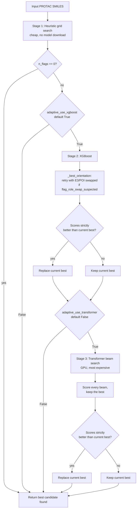

# The `model="adaptive"` pipeline

This document describes how `split_protac(protac_smiles, model="adaptive")` works end
to end: what it tries, in what order, how it decides a split is "good enough," and how
each piece was calibrated. For basic usage and the full argument reference, see the
[README](../README.md#splitting-strategies) — this document is the implementation
reference for how it actually makes decisions.

## Why this exists

The other `model` values in [`split_protac()`](../protac_splitter/protac_splitter.py)
are single strategies, or chains that fall back from one method to the next only on
**outright failure** (no valid 3-fragment reassembly at all — e.g.
`"heuristic->xgboost"`). That leaves a large failure mode uncovered: a split that
reassembles perfectly and *looks* structurally fine, but cut the molecule in a
chemically implausible place (E3 and POI roles swapped, most of the linker left
attached to one side, a fragment far too small or too large to be a real ligand).

`model="adaptive"` escalates on **quality**, not just failure. Every candidate —
regardless of which method produced it — is scored by the same reference-free
plausibility checks (`evaluation.score_split()`), and a more expensive method is only
tried when the cheaper one's best candidate still has open flags.

## Pipeline overview



Three properties hold throughout:

- **Never regresses.** A later stage only overwrites the current best when its
  candidate scores *strictly* better (see [Ranking](#ranking-candidates-_rank_key)
  below). A structurally-valid-but-flagged split is always preferred over a stage that
  fails outright, and `default_pred_n0` is never silently set to `None` if any stage
  produced something valid.
- **Escalation is scoped to what's still flagged.** Stage 2 only reprocesses rows
  Stage 1 left with `n_flags > 0`; Stage 3 only reprocesses rows still flagged after
  Stage 2. On an "easy" molecule, the default heuristic call alone (the first grid
  point) is often enough, and nothing further runs.
- **Every candidate goes through the same scorer.** Whether a prediction came from the
  heuristic grid, XGBoost, or the Transformer, it's judged by the identical
  `evaluation.score_split()` call — the ranking is method-agnostic by construction.

## Stage 1 — heuristic parameter grid

Implemented in `_run_heuristic_grid_ds()`. The betweenness-centrality heuristic
(`split_protac_graph_based(..., use_classifier=False)`) has two quality-relevant knobs:
`betweenness_threshold` and `use_capacity_weight`. Rather than a single fixed call, the
adaptive pipeline tries a small ordered grid, `_DEFAULT_ADAPTIVE_GRID`:

| # | `betweenness_threshold` | `use_capacity_weight` |
|---|---|---|
| 1 | 0.4 (package default) | False |
| 2 | 0.3 | False |
| 3 | 0.5 | False |
| 4 | 0.4 | True |
| 5 | 0.3 | True |
| 6 | 0.5 | True |

The package default is always tried first, so a molecule that already splits cleanly
with default settings costs exactly one heuristic call — the grid only keeps going if
that candidate is flagged. It stops at the first flag-free candidate; otherwise it
keeps the best-scoring one seen across all six. `betweenness_approx_frac` is *not*
part of the grid — it's a speed/approximation knob for very large graphs, not a
quality knob, so sweeping it wouldn't find a better split, only a cheaper approximate
one.

A custom grid can be passed via `adaptive_heuristic_grid=[(threshold, capacity), ...]`.

## Stage 2 — XGBoost

Implemented as part of `_run_adaptive_ds()`. Runs `split_protac_graph_based(...,
use_classifier=True)` only on rows Stage 1 left flagged. Its candidate is then checked
by [`_best_orientation()`](#role-orientation-correction-_best_orientation) before
competing with the current best. Disable with `adaptive_use_xgboost=False`.

## Stage 3 — Transformer (opt-in)

Implemented in `_run_transformer_scored_ds()`. Off by default
(`adaptive_use_transformer=False`) since it needs the `[transformer]` extra and a GPU
is recommended; the first two stages cover most cases. Unlike the plain `"transformer"`
/ `"transformer->xgboost"` strategies — which take the first beam-search candidate that
happens to reassemble — this stage scores **every** beam with `score_split` and keeps
the best one. Transformer candidates are *not* passed through `_best_orientation`: the
Transformer generates `[*:1]`/`[*:2]` directly as part of its own sequence output, with
no equivalent `distinguish_fragments()` step to second-guess.

## The QC scorer: `evaluation.score_split()`

This is the shared judge used by every stage, and also by the offline
[`dataset_qc.qc_row()`](../protac_splitter/data/curation/dataset_qc.py) pass — see
[Relationship to offline QC](#relationship-to-offline-dataset-qc) below. Given a
PROTAC SMILES and one candidate `"e3.linker.poi"` prediction, it returns a flat dict of
metrics and `flag_*` booleans. `count_flags()` reduces that to `(n_flags, reasons)`.

Only checks that vary with **which bonds were cut** are included — checks that depend
solely on the intact input molecule (BRENK instability, leaving groups) are constant
across every candidate split of the same PROTAC, so they can't discriminate between
methods/parameters and are deliberately left out (they live in `dataset_qc.py`
instead, as dataset-level QC, not split-selection signal).

| Flag | Fires when | Why |
|---|---|---|
| `flag_structural` | Prediction is invalid, doesn't have exactly 3 substructures, is missing an attachment point, or doesn't reassemble to the input | The hard gate — a non-negotiable precondition, checked first |
| `flag_e3_out_of_range` / `flag_poi_out_of_range` | Fragment MW outside `FRAGMENT_MW_BOUNDS` (E3: 150–700 Da, POI: 120–900 Da) **or** heavy-atom count outside `FRAGMENT_HEAVY_ATOM_BOUNDS` (E3: 10–55, POI: 8–70) | MW alone can be fooled by atom composition (a couple of halogens push MW into range on a nearly bare skeleton, or the reverse for a PEG-heavy fragment) — a fragment must clear both bars |
| `flag_linker_too_short` | Heavy atoms between the linker's two attachment points ≤ 1 | Near-zero-length linker (e3/poi directly bonded) is almost always a mis-cut |
| `flag_linker_branchy` | ≥ 2 non-ring branch points in the linker | A real linker is normally a simple tether; heavy non-ring branching suggests the cut swept in part of a ligand |
| `flag_e3_linker_leak` / `flag_poi_linker_leak` | Longest run of consecutive non-ring, unbranched heavy atoms anywhere off the fragment's own ring system ≥ `FRAGMENT_ATTACHMENT_CHAIN_LIMIT` (6) | The topological signature of a cut placed too early: real E3/POI cores are ring-based, so a long acyclic tail — whether in line with the attachment point *or* hanging off a different ring substituent — means part of the linker (e.g. a PEG/amide chain) is still fused on |
| `flag_e3_low_similarity` / `flag_poi_low_similarity` | Fragment's max Tanimoto similarity to its own reference set (`DEFAULT_REPRESENTATIVE_E3S` / `_WHS` in `graphs/clustering.py`) is below `e3_sim_threshold` / `poi_sim_threshold` (default 0.2 each) | Doesn't resemble any known E3 ligand / warhead — either a mis-cut, or a genuinely novel chemotype outside reference-set coverage |
| `flag_role_swap_suspected` | The E3-labeled fragment resembles known warheads more than known E3s **and** the POI-labeled fragment resembles known E3s more than known warheads — **and both of those cross-similarities individually clear a noise floor** (`min(e3_sim_threshold, poi_sim_threshold)`), not just the larger of two low numbers | Structural signature of `distinguish_fragments()` (or the Transformer) picking the right bonds but the wrong E3/POI label. The floor requirement matters: for a chemotype poorly covered by both reference lists, every similarity can sit under the noise floor, and picking the marginally-larger one is comparing noise to noise, not real evidence |

`flag_e3_linker_leak`/`flag_poi_linker_leak` were added, and `flag_role_swap_suspected`
was hardened against false positives, after both were observed to mis-fire in
practice — see [Calibration methodology](#calibration-methodology).

## Ranking candidates: `_rank_key()`

Every candidate is reduced to a 4-tuple; lower sorts as better:

```python
(flag_structural, n_flags, method_priority, -similarity)
```

1. **`flag_structural`** — a structurally invalid candidate always loses, full stop,
   regardless of anything else.
2. **`n_flags`** — fewer plausibility flags wins.
3. **`method_priority`** (`_METHOD_PRIORITY`: Heuristic/XGBoost = 0, Transformer = 1) —
   on an exact flag-count tie, Heuristic/XGBoost is preferred over the Transformer.
   Both graph-based methods assign E3-vs-POI identity via `distinguish_fragments()`,
   the same fingerprint-similarity check `score_split` itself uses to score fragments;
   the Transformer's labels come straight out of the sequence model with no such
   check, so its similarity score is treated as weaker evidence on a tie, not equal
   evidence.
4. **`-similarity`** (negated `e3_sim_to_known_e3 + poi_sim_to_known_wh`) — final
   tie-break, higher combined similarity to the *correct* reference set wins.

## Role-orientation correction: `_best_orientation()`

Graph-based methods pick bond cuts and then separately assign which cut fragment is
"E3" and which is "POI." The cuts can be right while the label is backwards — the
motivating case was a PROTAC where XGBoost correctly isolated the designed PEG linker
but mislabeled which side was E3 vs POI, scoring worse than a heuristic split with
objectively worse cuts, purely because of the wrong label.

`_best_orientation()` addresses this directly: when a Heuristic or XGBoost candidate
has `flag_role_swap_suspected` set, it also scores the same bond cuts with `[*:1]`/
`[*:2]` swapped (`_swap_e3_poi_labels()`) and keeps whichever orientation scores
better. This intentionally does **not** try both orientations unconditionally and keep
whichever has fewer flags — see below for why.

This logic lives in `protac_splitter.py`, not inside `evaluation.score_split()`
itself: `score_split` stays a faithful scorer of exactly the candidate it's given,
which `dataset_qc.py` depends on for honest QC reporting. The relabeling is an
adaptive-escalation-specific search step, not a scoring-semantics change.

## Calibration methodology

Every numeric threshold above, and the design of `_best_orientation`'s gating
condition, was set by measuring against real data rather than picked by intuition —
and in two cases, the first instinct was measurably wrong:

- **Thresholds** (`FRAGMENT_HEAVY_ATOM_BOUNDS`, `FRAGMENT_ATTACHMENT_CHAIN_LIMIT`) were
  calibrated against `Datasets/smiles/dataset-curated-held-out.csv` (~5,670 real
  curated PROTAC splits, 115 of them manually curated). That directory is gitignored
  (matched by the `**/*.csv` pattern) and not linked above for that reason — it's local
  to whichever machine downloaded it and won't be present in a fresh clone; regenerate
  or re-fetch it before relying on this methodology again. The approach: compute the
  relevant metric on the `Warhead SMILES` / `E3 Ligase Ligand SMILES` columns, then set
  the threshold with margin above the manually-curated subset's max, informed by how
  much of the full set's tail it trims. `FRAGMENT_ATTACHMENT_CHAIN_LIMIT`
  specifically went through two rounds: an initial calibration against the small
  `tests/test_protac_splitter.py` example set suggested 5; recalibrating against the
  much larger CSV (max 4 on manually-curated rows, p99 of 6 on the full set) settled on
  6. It was *also* revised a second time when the underlying algorithm was generalized
  from "walk the chain in line with the attachment point" to "check every substituent
  on the attachment's ring system," since that changed what the metric measures.
- **`_best_orientation`'s gating condition** was the more consequential correction. The
  first version tried both orientations unconditionally for every candidate and kept
  whichever had fewer flags. That fixed the motivating example, but checked against
  the curated CSV at scale, it would have *wrongly* "corrected" ~15% of
  already-correctly-labeled rows in the manually-curated subset — flipping a
  correct label because an unrelated flag (typically `flag_poi_low_similarity` or
  `flag_e3_low_similarity`) happened to cross its threshold in the swapped
  orientation, not because of any real evidence about the roles. Gating the swap
  attempt on `flag_role_swap_suspected` already being true — reusing the
  noise-floor-checked signal instead of a raw flag-count comparison — cut the false
  "correction" rate to ~3.5%, which is that flag's own baseline false-positive rate on
  the manually-curated set, not something the swap logic adds on top of it.

The general lesson driving both: a fix that looks correct on one or two motivating
examples can still be net-negative at scale, particularly for anything touching
similarity to the reference lists, since those lists are small (32 E3 ligands, 48
warheads) and don't evenly cover chemical space. Any future threshold or corrective
heuristic in this area should be checked against the curated CSV — both for the cases
it's meant to fix *and* for regressions on cases that were already correct — before
being treated as settled.

## Relationship to offline dataset QC

[`dataset_qc.qc_row()`](../protac_splitter/data/curation/dataset_qc.py) (driven by
[`scripts/qc_dataset.py`](../scripts/README.md)) is the offline counterpart: given a
CSV of `(protac_smiles, prediction)` pairs — from any source, not just this pipeline —
it flags suspect rows for manual review. It calls the exact same `score_split()` /
`count_flags()` for the split-dependent checks described above, then adds checks that
`score_split` deliberately excludes because they can't discriminate between candidates
of the *same* molecule:

- `flag_unstable` / `flag_leaving_group` — BRENK instability and synthesis-artefact
  SMARTS scanned on the *intact* input molecule (constant across any split of it).
- `flag_method_disagreement` — re-splits with the heuristic and compares fragment
  similarity against whatever prediction is being audited.
- `flag_low_confidence` — the XGBoost edge classifier's own decision margin.

In other words: `score_split` is the part of the QC logic that's meaningful as a
*search objective* (it changes with the candidate), and it's shared; the rest is
audit-only and stays in `dataset_qc.py`.

## Output columns

`model="adaptive"` returns three keys beyond the usual `default_pred_n0` /
`model_name`:

- **`heuristic_params`** — which grid point won (e.g.
  `"betweenness_threshold=0.4,use_capacity_weight=False"`), only populated when
  `model_name == "Heuristic"`. Aggregating this across a batch run is a direct signal
  for what the package defaults should be.
- **`n_flags`** / **`review_reasons`** — from `count_flags()`, `review_reasons` being a
  `;`-joined list of whichever flags in the table above are still set on the winning
  candidate. `n_flags == 0` means a clean split; `n_flags > 0` means the pipeline
  exhausted every enabled stage without finding one, and the row is worth a manual
  look, same as a `dataset_qc.py`-flagged row.

## Known limitations

- The E3/warhead reference lists (`DEFAULT_REPRESENTATIVE_E3S`, `DEFAULT_REPRESENTATIVE_WHS`
  in `graphs/clustering.py`) are small (32 and 48 entries respectively). Any check
  built on similarity to them — `flag_e3/poi_low_similarity`, `flag_role_swap_suspected`,
  the `_best_orientation` tie-break — is only as good as that coverage. A genuinely
  novel E3 ligand or warhead chemotype can legitimately score low against both lists,
  which looks identical to a mis-cut.
- `_best_orientation` only fires on `flag_role_swap_suspected`; a role swap that
  doesn't trip that specific flag (e.g. because one side's evidence doesn't clear the
  noise floor) won't be reconsidered.
- None of this replaces having a labeled test set. These checks are reference-free
  plausibility proxies, not ground truth — see the calibration section above for a
  concrete case where optimizing against them directly would have made things worse.
